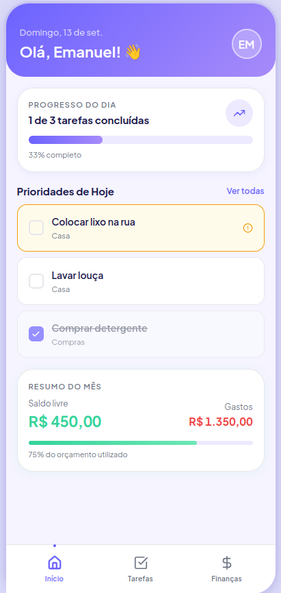
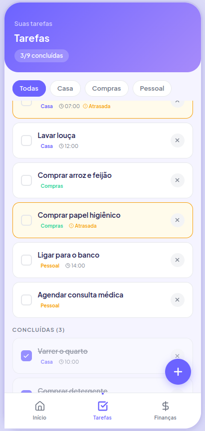
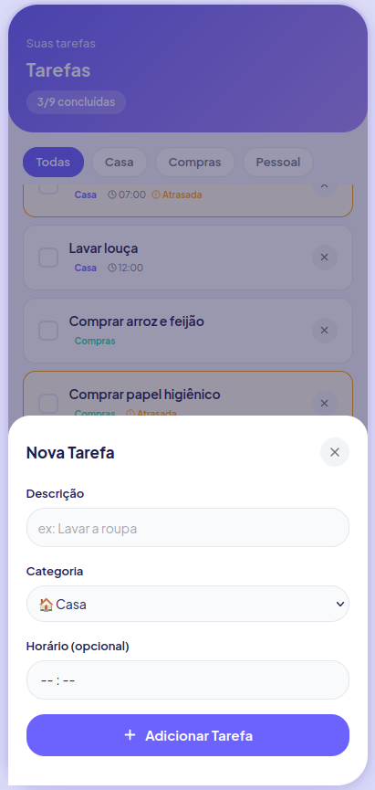
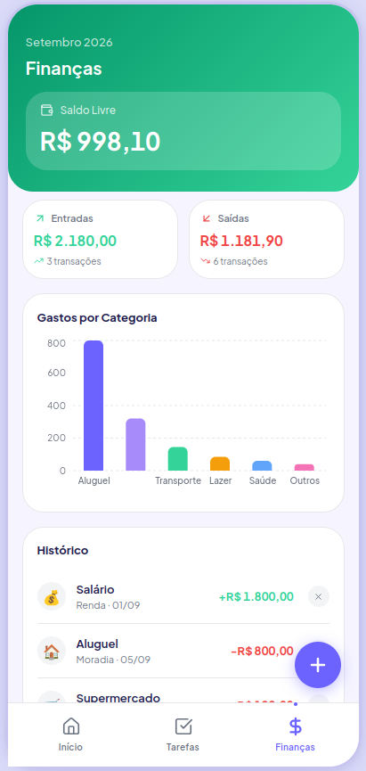
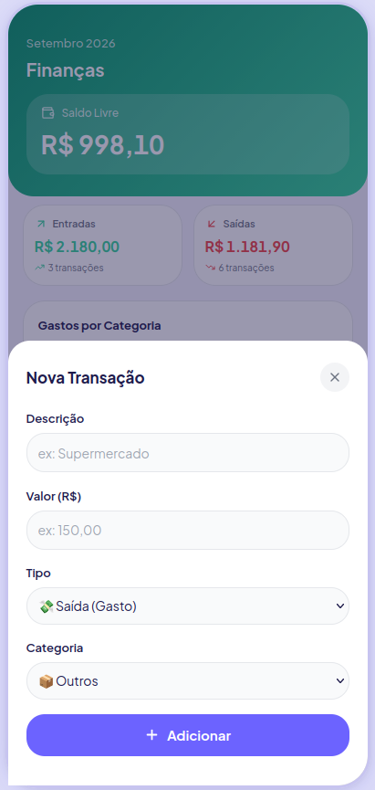
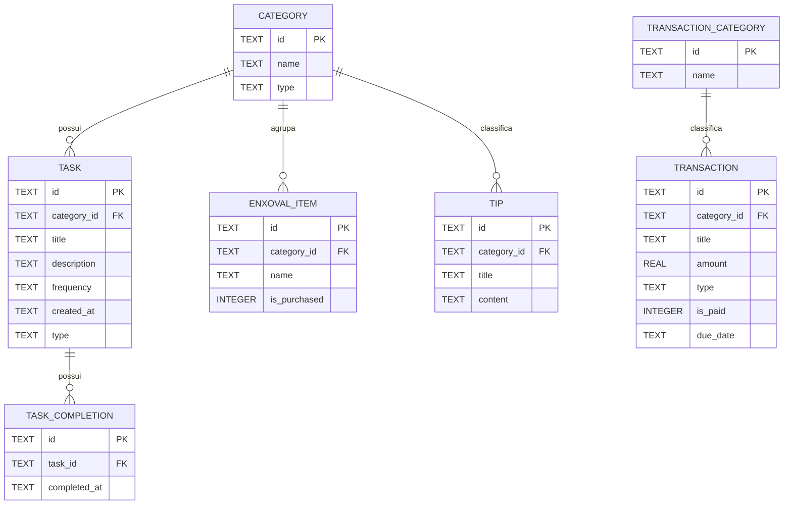

# Sobreviva Fácil

## 1. Sobre o app
> "Sobrevivencia Fácil" é um aplicativo mobile desenvolvido para auxiliar pessoas na jornada de morar sozinho pela primeira vez. O app serve como um guia prático de 'sobrevivencia', oferecendo listas de tarefas domésticas, dicas de economia e organização, com o objetivo de tornar a transição para a vida independente mais simples e organizada.

####  **Funcionalidades**

O projeto está dividido em duas fases de desenvolvimento, priorizando a entrega de valor imediato (MVP) e escalando para funcionalidades mais complexas no futuro.

####  Fase 1: MVP (Produto Mínimo Viável)
Foco estrutural no gerenciamento prático e rápido da nova rotina.

**Gestão de Rotina**
- [ ] **Cronograma de Limpeza Predefinido:** Banco de dados populado com tarefas padrão de limpeza diárias, semanais e mensais.
- [ ] **Frequência das Tarefas:** Indicador visual e lógica de repetição na interface.
- [ ] **Checklists Customizáveis:** Formulário para adição de demandas e rotinas específicas do usuário.
- [ ] **Ações de Conclusão:** Checkbox funcional para dar baixa imediata nas atividades.
- [ ] **Detalhes da Tarefa:** Tela ou modal contendo a descrição e o escopo da atividade selecionada.
- [ ] **Progresso da Rotina:** Barra de progresso visual calculada com base na proporção de itens concluídos no período.

**Controle Financeiro e Planejamento**
- [ ] **Calculadora de Moradia:** Interface direta para abater despesas fixas (aluguel, luz, internet) da receita mensal.
- [ ] **Checklist de Enxoval:** Lista predefinida de itens essenciais de casa nova, pronta para acompanhamento.

**Conteúdo Rápido**
- [ ] **Dicas para Morar Sozinho:** Seção de leitura rápida com conselhos fundamentais de sobrevivência.
- [ ] **Busca e Categorias:** Filtros por tags (Limpeza, Cozinha, Dinheiro) e barra de pesquisa por texto.
- [ ] **Dicas de Economia:** Textos curtos e contextuais voltados para a redução do custo de vida.

---

#### Fase 2: Funcionalidades Avançadas (V2)
Expansão do aplicativo com automações, alertas nativos e curadoria de conteúdo denso.

**Automação e Alertas**
- [ ] **Notificações de Rotina:** Integração com alertas push nativos para tarefas críticas e pontuais.
- [ ] **Alertas de Vencimento:** Tarefas em *background* para disparar lembretes automáticos próximos à data de vencimento de boletos.

**Visualização Avançada**
- [ ] **Calendário de Tarefas:** Renderização de uma visualização mensal em grade interativa.

**Curadoria de Conteúdo e Solução de Problemas**
- [ ] **Tutoriais de Manutenção:** Manuais passo a passo para pequenos reparos domésticos (ex: resistência de chuveiro, desentupimentos).
- [ ] **SOS Casa:** Diretório local para salvar contatos de chaveiros, encanadores e imobiliária.

## 2. Protótipo de Telas (Wireframes)

Para a validação visual do MVP, foram projetadas as três interfaces principais que compõem o fluxo de navegação primário do aplicativo (Bottom Tab Navigation):

1.  **Início (Home):** Painel geral com o progresso diário, tarefas prioritárias e resumo rápido do saldo.
2.  **Minha Rotina (Tarefas):** Gestão detalhada com filtros de frequência (Diário, Semanal, Mensal) e funcionalidade de conclusão.
3.  **Controle Financeiro (Finanças):** Visão centralizada de receitas, despesas fixas e controle de vencimentos iminentes.

Abaixo está o mapa de telas com a proposta de layout:

## 3. Modelagem do Banco

#### Arquitetura e Tecnologia de Persistência

O aplicativo utiliza **SQLite Local**, por meio da biblioteca `expo-sqlite`, como tecnologia de persistência. A escolha de um banco de dados relacional embarcado permite que o aplicativo armazene e consulte os dados diretamente no dispositivo, possibilitando seu funcionamento **offline** e reduzindo a dependência de serviços externos durante a fase de MVP.

A persistência será utilizada para armazenar os principais dados manipulados pelo aplicativo, como tarefas, histórico de conclusão das tarefas, dicas, itens de enxoval e transações financeiras.

#### Estrutura de Dados

A modelagem do banco de dados foi desenvolvida para atender aos principais recursos do MVP: **gestão da rotina, conteúdo informativo, organização do enxoval e controle financeiro**.

O banco utiliza relacionamentos entre as entidades por meio de **chaves primárias (PK)** e **chaves estrangeiras (FK)**. As cardinalidades estão representadas no diagrama abaixo.

> **Nota sobre valores booleanos:** o SQLite não possui um tipo `BOOLEAN` nativo. Por isso, os campos booleanos são armazenados como `INTEGER`, utilizando `0` para falso e `1` para verdadeiro.

#### Descrição das Principais Entidades

*   **`CATEGORY`**: armazena categorias utilizadas para organizar tarefas, dicas e itens de enxoval.
*   **`TASK`**: representa as tarefas domésticas disponíveis no aplicativo, incluindo sua frequência e informações descritivas.
*   **`TASK_COMPLETION`**: registra cada conclusão de uma tarefa. Essa separação permite manter o histórico de tarefas recorrentes, como tarefas semanais ou mensais.
*   **`TRANSACTION_CATEGORY`**: organiza as transações financeiras em categorias específicas.
*   **`TRANSACTION`**: representa receitas e despesas, armazenando valor, tipo, vencimento e status de pagamento.
*   **`ENXOVAL_ITEM`**: representa os itens necessários para equipar uma residência e permite acompanhar quais itens já foram adquiridos.
*   **`TIP`**: armazena as dicas disponibilizadas pelo aplicativo e sua respectiva categoria.

#### Cardinalidades

*   Uma **`CATEGORY`** pode possuir várias **`TASKs`** (1:N), enquanto cada tarefa pertence a uma categoria.
*   Uma **`CATEGORY`** pode agrupar vários **`ENXOVAL_ITEMs`** (1:N), enquanto cada item pertence a uma categoria.
*   Uma **`CATEGORY`** pode classificar várias **`TIPs`** (1:N), enquanto cada dica pertence a uma categoria.
*   Uma **`TASK`** pode possuir vários registros de **`TASK_COMPLETION`** (1:N), permitindo armazenar o histórico de suas conclusões.
*   Uma **`TRANSACTION_CATEGORY`** pode classificar várias **`TRANSACTIONs`** (1:N), enquanto cada transação pertence a uma categoria.

## 4. Planejamento de Sprints

O desenvolvimento do **Sobreviva Fácil** está planejado para ocorrer ao longo de **6 semanas**, dividido em Sprints semanais. O projeto será desenvolvido do zero utilizando Expo, React Native e TypeScript, evoluindo desde a estrutura inicial e prototipação até a implementação das funcionalidades, persistência local, testes e preparação da entrega final.

#### Sprint 1: Configuração e Estrutura do Projeto (Semana 1)

**Objetivo:** criar a base do aplicativo e estabelecer sua arquitetura inicial.

- [ ] Criar o projeto utilizando **Expo + React Native + TypeScript**.
- [ ] Configurar o **Expo Router**.
- [ ] Definir a estrutura de pastas do projeto.
- [ ] Criar as telas principais do aplicativo.
- [ ] Configurar a navegação utilizando **Tab Navigation** e **Stack Navigation**.
- [ ] Configurar os arquivos `_layout.tsx`.
- [ ] Configurar o repositório Git e publicar o projeto no GitHub.
- [ ] Realizar a primeira execução e validação do aplicativo em Android/iOS.

#### Sprint 2: Prototipação e Interface (Semana 2)

**Objetivo:** definir a experiência visual e implementar a primeira versão das interfaces.

- [ ] Criar os protótipos das telas no **Figma**.
- [ ] Definir o fluxo de navegação entre as telas.
- [ ] Definir cores, tipografia, espaçamentos e demais elementos visuais.
- [ ] Implementar as interfaces das telas principais.
- [ ] Criar componentes React reutilizáveis.
- [ ] Implementar listas e formulários necessários para as funcionalidades.
- [ ] Utilizar dados simulados para validar a interface.
- [ ] Revisar a experiência de navegação e usabilidade.

#### Sprint 3: Modelagem e Persistência de Dados (Semana 3)

**Objetivo:** implementar a estrutura de dados definida para o aplicativo.

- [ ] Finalizar a modelagem do banco de dados.
- [ ] Criar o diagrama Entidade-Relacionamento.
- [ ] Instalar e configurar o `expo-sqlite`.
- [ ] Criar o banco de dados SQLite local.
- [ ] Implementar as tabelas definidas na modelagem.
- [ ] Implementar chaves primárias e estrangeiras.
- [ ] Criar a carga inicial de categorias, tarefas e dicas.
- [ ] Criar as funções de acesso e manipulação dos dados.
- [ ] Validar a criação e persistência dos dados localmente.

#### Sprint 4: Implementação da Rotina e Tarefas (Semana 4)

**Objetivo:** implementar a principal funcionalidade do aplicativo: o gerenciamento da rotina doméstica.

- [ ] Integrar a tela de rotina ao banco SQLite.
- [ ] Implementar a listagem de tarefas.
- [ ] Implementar a criação e edição de tarefas.
- [ ] Implementar categorias de tarefas.
- [ ] Implementar diferentes frequências de tarefas.
- [ ] Implementar o registro de conclusão das tarefas.
- [ ] Implementar o histórico de conclusão das tarefas recorrentes.
- [ ] Calcular e exibir o progresso da rotina.
- [ ] Validar a persistência das alterações realizadas pelo usuário.

#### Sprint 5: Funcionalidades Complementares (Semana 5)

**Objetivo:** implementar as funcionalidades secundárias planejadas para o MVP.

- [ ] Implementar a seção de **Dicas**.
- [ ] Implementar categorias e filtros de dicas.
- [ ] Implementar a seção de **Enxoval**.
- [ ] Implementar o controle dos itens adquiridos.
- [ ] Implementar a seção de **Finanças**, caso faça parte do MVP.
- [ ] Implementar o cadastro de receitas e despesas.
- [ ] Implementar categorias de transações financeiras.
- [ ] Implementar os cálculos e resumos financeiros.
- [ ] Integrar todas as funcionalidades ao banco SQLite.

#### Sprint 6: Testes, Refinamento e Entrega (Semana 6)

**Objetivo:** garantir a estabilidade do aplicativo e preparar a versão final para entrega.

- [ ] Substituir todos os dados simulados restantes por dados persistidos no SQLite.
- [ ] Testar os principais fluxos de navegação.
- [ ] Testar as operações de criação, consulta, atualização e exclusão de dados.
- [ ] Testar a persistência dos dados após fechar e reabrir o aplicativo.
- [ ] Implementar e executar testes automatizados com **Jest** e **Maestro**, quando aplicável.
- [ ] Corrigir bugs encontrados durante os testes.
- [ ] Revisar estados de carregamento, listas vazias e mensagens de erro.
- [ ] Revisar a interface e a experiência de usuário.
- [ ] Atualizar a documentação do projeto.
- [ ] Atualizar o README com o estado final do aplicativo.
- [ ] Preparar a versão final para entrega.
